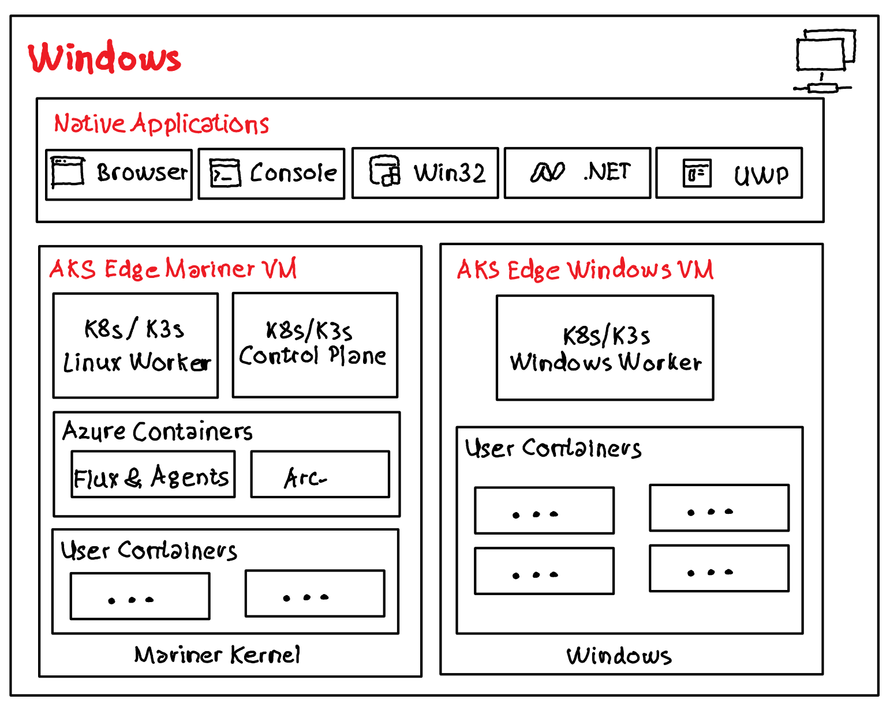

# Azure AKS Edge Essentials - Install and Arc-enable K3s

## Overview

[AKS Edge Essentials](https://learn.microsoft.com/en-us/azure/aks/hybrid/aks-edge-overview) is a Microsoft managed lightweight Kubernetes distribution designed to easily deploy Kubernetes on "PC-class" or "light edge" hardware running Windows with a simplified installation experience.

Microsoft supports the ***entire software stack from kernel to cloud***.

- Customers can choose the 10-year Long-Term Servicing Channel (LTSC) version of the Windows IoT host OS
- The evergreen [CBL-Mariner Linux](https://en.wikipedia.org/wiki/CBL-Mariner) VM for the Kubernetes control node is supported and patched for all known CVEs. 
- AKS Edge Essentials clusters can be Arc-enabled and managed as an Azure resource from the Azure portal. This enables customers to streamline deployment and management using cloud services like GitOps, Azure monitor, Azure Policy and other Arc-enabled services that can be extended to you AKS Edge Essentials cluster.
- AKS Edge Essentials can run both Linux based and Windows based containers.
- AKS Edge Essentials provides lightweight, CNCF-conformant K8S ***and*** K3S distributions. Supported and managed by Microsoft.

## Repo Content

[The Powershell script in this repo](src/CreateEnv/README.md) uses the Azure CLI to create a single machine deployment with a K3s control plane and a linux worker.

After successfully installing AKS EE on a VM (running Windows 11 Pro) AKS EE will be Arc-enabled and can be maintained, monitored ... from the Azure Portal. 
