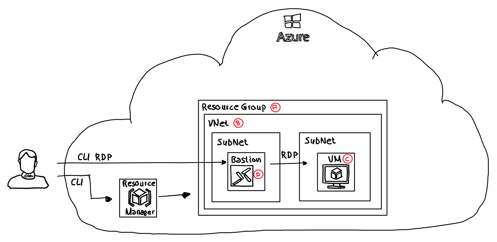

# Installation & Configuration AKS EE

## Chapter 1

In chapter 1 the basic Azure Environment will be created. It consists of:

- ***A***: A Resource Group to host all (except the Azure Service Principal created in XX.xx)
- ***B***: A VNet with two SubNets
- ***C***: A Windows 11 VM. AKS EE will be installed on this VM
- ***D***: A Bastion instance to connect securely to the Windows 11 VM as it does not expose any public endpoint.


### Step 1.1

```Powershell
az login
$subscriptionId = (
    (
        az account list `
            --query "[?isDefault]" 
    ) | ConvertFrom-Json
).id
az account set --sub scription $subscriptionId
```

- Login to Azure and select default Azure subscription. All resources will be created within this subscription.

### Step 1.2

```Powershell
$random = Get-Random -Minimum 100 -Maximum 999
```

- Defines a random number between 100 and 999 which will be used in the naming of Azure services to allow creation of multiple instances of the AKS EE VM (if wanted).

### Step 1.3

```Powershell
$resourceGroup = "FTA.AKSEESample"
$location = "WestEurope"

az group create `
    --location $location `
    --resource-group $resourceGroup
```

- Creates a resource group to host further Azure services

### Step 1.4

```Powershell
$vnetName = "AKSEESampleVNet"
$vnetSubName = "default"
$vnetAddressPrefixes = "10.0.0.0/16"
$vnetSubAddressPrefix = "10.0.0.0/24"

$subNetName = "AzureBastionSubnet"
$subNetPrefixes = "10.0.1.0/26"

az network vnet create `
    --name $vnetName `
    --resource-group $resourceGroup `
    --address-prefixes $vnetAddressPrefixes `
    --subnet-name $vnetSubName `
    --subnet-prefix $vnetSubAddressPrefix

az network vnet subnet create `
    --name $subNetName `
    --resource-group $resourceGroup `
    --vnet-name $vnetName `
    --address-prefixes $subNetPrefixes
```

- Creates a VNet (10.0.0.0/16) with two SubNets (10.0.0.0/24 and 10.0.1.0./26). The SubNets are called "AzureBastionSubnet" & "default". As expected the VM will be created in the default SubNet and the Bastion instance to connect to the VM will be placed within the "AzurBastionSubnet".

### Step 1.5

```Powershell
$ipName = "AKSEESampleIp"
$bastionName = "AKSEESampleBastion"

az network public-ip create `
    --name $ipName `
    --resource-group $resourceGroup `
    --sku Standard

az network bastion create `
    --name $bastionName `
    --public-ip-address $ipName `
    --resource-group $resourceGroup `
    --vnet-name $vnetName `
    --location $location
```

- Creates a Public Ip which will be assigned to the Bastion instance which will be also created within this step.

### Step 1.6

```Powershell
$vmName = "AKSEESample$Random"
$vmUserName = "azureuser"
$vmUserPwd = "!!P@ssw0rd!!"
$vmImage = "microsoftwindowsdesktop:windows-11:win11-22h2-pro:latest"
$vmSize = "Standard_D4s_v3"

az vm create `
    --resource-group $resourceGroup `
    --name $vmName `
    --image $vmImage `
    --vnet-name $vnetName `
    --subnet $vnetSubName `
    --size $vmSize `
    --public-ip-sku Standard `
    --admin-username $vmUserName `
    --admin-password $vmUserPwd `
    --public-ip-address '""'
```

- A Windows 11 VM (Win11-22h2-pro) will be created without public ip address. The VM will be placed into the "default" VNet SubNet.

### Step 1.7

```Powershell
az vm update `
    --name $vmName `
    --resource-group $resourceGroup `
    --set identity.type='SystemAssigned'
```

- Windows 11 VM will be updated to allow Bastion RDP access.

## Chapter 2

In chapter 2 the newly created Win11 VM will be configured:

- ***A***: Enable Hyper-V on the VM
- ***B***: Download AKS EE
- ***C***: Install AKS EE Host Features


### Step 2.1

```Powershell
$script = "Enable-WindowsOptionalFeature -Online -FeatureName Microsoft-Hyper-V-All -Confirm"
$script = "ECHO Y | powershell Enable-WindowsOptionalFeature -Online -FeatureName Microsoft-Hyper-V -All"
az vm run-command invoke `
    --resource-group $resourceGroup `
    --name $vmName `
    --command-id RunPowerShellScript `
    --scripts $script

$script = "Restart-Computer -Force"
az vm run-command invoke `
    --resource-group $resourceGroup `
    --name $vmName `
    --command-id RunPowerShellScript `
    --scripts $script
```

- Uses `az vm run` to invoke Powershell commands which
  - Enables Hyper-V on the VM
  - Reboots the VM after Hyper-V enablement

### Step 2.2

```Powershell
$aksEEUrl = "https://aka.ms/aks-edge/k3s-msi"
$aksEEOutFile = "c:\k3s.msi"

$script = "curl.exe -L -o $aksEEOutFile $aksEEUrl "
az vm run-command invoke `
    --resource-group $resourceGroup `
    --name $vmName `
    --command-id RunPowerShellScript `
    --scripts $script

$script = "msiexec.exe /i $aksEEOutFile"
az vm run-command invoke `
    --resource-group $resourceGroup `
    --name $vmName `
    --command-id RunPowerShellScript `
    --scripts $script
```

- Downloads the K3s control plane installation MSI file to the VM and installs the MSI

### Step 2.3

```Powershell
$script = "Set-ExecutionPolicy Bypass -Scope Process -Force; Import-Module AksEdge"
az vm run-command invoke `
    --resource-group $resourceGroup `
    --name $vmName `
    --command-id RunPowerShellScript `
    --scripts $script
```

- Sets the PowerShell execution policy to "bypass" for the current process and imprts the AksEdge Powershell module

### Step 2.4

```Powershell
$script = "ECHO Y | powershell Install-AksEdgeHostFeatures"
az vm run-command invoke `
    --resource-group $resourceGroup `
    --name $vmName `
    --command-id RunPowerShellScript `
    --scripts $script
```

- Installs the Aks Edge host features on the VM

## Chapter 3

Create AKS Edge configuration & execute AKS EE deployment:

- ***A***: Create Storage Account & Container
- ***B***: Create AKS EE config
- ***C***: Upload AKS EE config to Storage Account
- ***D***: Download AKS EE config & execute AKS EE deployment


### Step 3.1

```Powershell
$accountName = "aksconfig$random"
$containerName = "aksconfig"

az storage account create `
    --name $accountName `
    --resource-group $resourceGroup `
    --location $location `
    --sku Standard_RAGRS `
    --kind StorageV2

az storage container create `
    --name $containerName `
    --account-name $accountName
```

- Creates Storage Account

### Step 3.2

```Powershell
$configRemoteFile = "aksconfig.json"
$configLocalFile = ".\src\CreateEnv\AksEEConfig\AksEEConfig.json"
$configLocalFileTemplate = ".\src\CreateEnv\AksEEConfig\AksEEConfigTemplate.json"

$aksEEConfig = Get-Content -Raw $configLocalFileTemplate | ConvertFrom-Json
$aksEEConfig.User.AcceptEula = $true
$aksEEConfig.User.AcceptOptionalTelemetry = $true
$aksEEConfig.Init.ServiceIpRangeSize = 10
Out-File -FilePath $ConfigLocalFile -InputObject ($aksEEConfig | ConvertTo-Json -Depth 10)

az storage blob upload `
    --account-name $accountName `
    --container-name $containerName `
    --name $configRemoteFile `
    --file $configLocalFile `
    --auth-mode key `
    --connection-string $accountConnectionString `
    --overwrite
```

- Updates existing default AKS EE configuration file
  - Accepts Eula
  - Accpets Optional Telmeetry
  - ...
- Uploads AKS EE configuration file to Storage Account 

### Step 3.3

```Powershell
$configExpiry = (Get-Date).AddHours(1).ToString("yyyy-MM-ddTHH:mmZ")
$configHost = "c:\AksEEConfig.json"

$accountConnectionString = (
    az storage account show-connection-string `
        --name $accountName `
        --resource-group $resourceGroup `
        --output tsv `
)

$accountKey = (
    az storage account keys list `
        --resource-group $resourceGroup `
        --account-name $accountName `
        --query [0].value `
        --output tsv `
)

$configUri = ( `
    az storage blob generate-sas `
        --account-name $accountName `
        --account-key $accountKey `
        --container-name $containerName `
        --name $configRemoteFile `
        --permissions acdrw `
        --full-uri `
        --expiry $configExpiry `
        --output tsv `
)

$script = "Invoke-webrequest -URI '$configUri' -OutFile $configHost"
az vm run-command invoke `
    --resource-group $resourceGroup `
    --name $vmName `
    --command-id RunPowerShellScript `
    --scripts $script

$script = "ECHO Y | Powershell New-AksEdgeDeployment -JsonConfigFilePath $configHost"
az vm run-command invoke `
    --resource-group $resourceGroup `
    --name $vmName `
    --command-id RunPowerShellScript `
    --scripts $script
```

- Creates a public SAS for the uploaded configuration file with a life time of one hour
- Downloads the AKS EE configuration file using the SAS to the VM
- Uses Powershell ```New-AksEdgeDeployment``` in combination with the downloaded configuration file to create the K3s deployment on the VM

## Chapter 4

Arc-enable AKS EE installed in VM

- ***A***: Install Powershell modules to Arc Enable AKS Edge Essential
- ***B***: Create Service Principal to Arc enable AKS EE
- ***C***: Update config file to Arc enable AKS EE
- ***D***: Upload/download config file to/from Blob
- ***E***: Connect AKS EE to Azure management tools
- ***F***: List Arc-enabled K8s


### Step 4.1

```Powershell
$script = "ECHO Y | Powershell Install-Module Az.Resources -Repository PSGallery -Force -AllowClobber -ErrorAction Stop"  
az vm run-command invoke `
    --resource-group $resourceGroup `
    --name $vmName `
    --command-id RunPowerShellScript `
    --scripts $script

$script = "ECHO Y | Powershell Install-Module Az.Accounts -Repository PSGallery -Force -AllowClobber -ErrorAction Stop" 
az vm run-command invoke `
    --resource-group $resourceGroup `
    --name $vmName `
    --command-id RunPowerShellScript `
    --scripts $script

$script = "ECHO Y | Powershell Install-Module Az.ConnectedKubernetes -Repository PSGallery -Force -AllowClobber -ErrorAction Stop"
az vm run-command invoke `
    --resource-group $resourceGroup `
    --name $vmName `
    --command-id RunPowerShellScript `
    --scripts $script
```

- Using ```az vm run-command``` to install Powershell modules to Arc-enable AKS EE within the VM

### Step 4.2

```Powershell
$principalName = "RobEichAksArcEnable"
$principalScope = "/subscriptions/$subscriptionId"
$principalRole = "Contributor"

$principalInfo = ( `
    az ad sp create-for-rbac `
        --display-name $principalName `
        --role $principalRole `
        --scopes $principalScope
)
```

- Creates an AAD Service Principal which is used to Arc-enble AKS EE. *Contributor* right is needed on the subscription level

### Step 4.3

```Powershell
$principalAppId = ($principalInfo | ConvertFrom-Json).appId
$principalPassword = ($principalInfo | ConvertFrom-Json).password
$principalTenant = ($principalInfo | ConvertFrom-Json).tenant
$configClusterName = "AksEE$Random"

$aksEEConfig = Get-Content .\src\CreateEnv\AksEEConfig\AksEEConfig.json | ConvertFrom-Json
$aksEEConfig.Arc.ClusterName = $configClusterName
$aksEEConfig.Arc.Location = $location
$aksEEConfig.Arc.ResourceGroupName = $resourceGroup
$aksEEConfig.Arc.SubscriptionId = $subscriptionId
$aksEEConfig.Arc.TenantId = $principalTenant
$aksEEConfig.Arc.ClientId = $principalAppId
$aksEEConfig.Arc.ClientSecret = $principalPassword

Out-File -FilePath $ConfigLocalFile -InputObject ($aksEEConfig | ConvertTo-Json -Depth 10)
```

- The Arc section within the default AKS EE configuration file will be updated with the information from the previously created Service Principal and further information (e.g. ResourceGroup, Subscription, Name ...)

### Step 4.4

```Powershell
az storage blob upload `
    --account-name $accountName `
    --container-name $containerName `
    --name $configRemoteFile `
    --file $configLocalFile `
    --auth-mode key `
    --connection-string $accountConnectionString `
    --overwrite

$script = "Invoke-webrequest -URI '$configUri' -OutFile $configHost"

az vm run-command invoke `
    --resource-group $resourceGroup `
    --name $vmName `
    --command-id RunPowerShellScript `
    --scripts $script
```

- Upload AKS EE config file to storage account and download the config file from the AKS EE VM using ```az vm run-command```

### Step 4.5

```Powershell
$script = "ECHO Y | Powershell Connect-AksEdgeArc -JsonConfigFilePath $configHost"

az vm run-command invoke `
    --resource-group $resourceGroup `
    --name $vmName `
    --command-id RunPowerShellScript `
    --scripts $script
```

- Arc-enable the AKS EE K3s 
- Might take some minutes until AKS EE is shown with in Azure

### Step 4.6

```Powershell
az connectedk8s list

# Create kube config to connect using kubectl on the VM (optional)
$script = "ECHO Y | Powershell Get-AksEdgeKubeConfig"
az vm run-command invoke `
    --resource-group $resourceGroup `
    --name $vmName `
    --command-id RunPowerShellScript `
    --scripts $script
```

- Show Arc-enabled K8s/K3s installations. The AKS EE installation will be shown.
- Optional step to create Kube Config in the users .\Kube folder to use ```kubectl``` on the Win11 VM.

## Chapter 5

Housekeeping

```Powershell
az ad sp delete `
    --id $principalAppId

$script = "ECHO Y | Powershell Disconnect-AksEdgeArc -JsonConfigFilePath $configHost"
az vm run-command invoke `
    --resource-group $resourceGroup `
    --name $vmName `
    --command-id RunPowerShellScript `
    --scripts $script

az group delete `
    --resource-group $resourceGroup
```

- Delete Service Principal
- Disconnect AKS EE from Azure Arc
- Delete Resource Group hosting all Azure resources